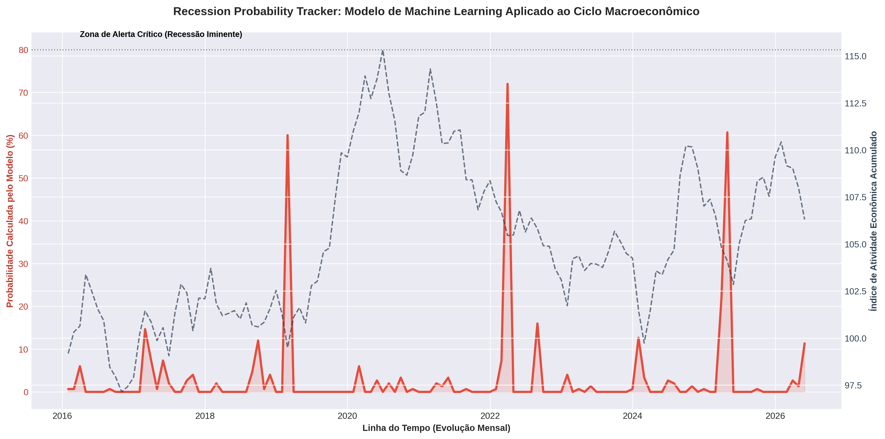

# Recession Probability Tracker: Inteligência Artificial Aplicada a Ciclos Macroeconômicos 📊🤖

Este repositório armazena o desenvolvimento de um **Modelo Preditivo de Machine Learning** voltado ao monitoramento e antecipação de pontos de inflexão no ciclo econômico brasileiro. Utilizando um classificador baseado no algoritmo **Random Forest**, o pipeline consome dados reais de alta frequência do **IBC-Br (Proxy do PIB mensal do Banco Central)** via API do IpeaData, integra *features* financeiras de leading indicators (como o *Yield Curve Spread*) e calcula a probabilidade estatística de recessão iminente.

---

## 🎯 Abordagem Temática e Fundamentação Macroeconômica

A identificação antecipada de recessões técnicas é um dos problemas mais complexos e vitais para a alocação tática de ativos, gestão de risco de crédito e formulação de políticas públicas. Modelos tradicionais baseados puramente em dados defasados do PIB trimestral falham pelo fator *lag* (atraso temporal). 

Para contornar essa barreira, este projeto adota uma abordagem de **Leading Indicators (Indicadores Avançados)** respaldada pela literatura clássica de economia quantitativa:

1. **Índice de Atividade Econômica do Banco Central (IBC-Br):** Utilizado como a proxy mensal do comportamento do PIB (PIB de alta frequência), capturando a variação marginal da atividade industrial, de serviços e agropecuária.
2. **Inversão da Curva de Juros (Yield Curve Spread):** Mensura o diferencial entre os títulos públicos de longo e curto prazo. Conforme documentado pioneiramente por **Estrella & Mishkin (1998)**, um estreitamento ou inversão do *spread* (valores próximos ou abaixo de zero) reflete uma forte expectativa do mercado de desaceleração econômica e cortes futuros na taxa básica de juros, tornando-se um dos preditores mais confiáveis de recessão.
3. **Índices de Confiança Empresarial:** Capturam o canal de transmissão de expectativas (psicologia dos agentes econômicos). Quedas acentuadas na confiança precedem a contração na formação bruta de capital fixo (investimento em maquinário e expansão) e demissões corporativas.

---

## 🧠 Engenharia de Dados e IA: Arquitetura do Pipeline

O pipeline foi projetado para operar com total resiliência de produção, estruturado em cinco etapas consecutivas:

1. **Ingestão de Dados em Tempo Real (ETL Layer):** O script consome a API REST oficial do **IpeaData**, extraindo a série histórica do IBC-Br (`GAC_IBCBR12`). O pipeline conta com um **Mecanismo de Fallback Estocástico** que, em caso de instabilidade dos servidores governamentais, gera uma matriz baseada em distribuições normais realistas para garantir a execução contínua do ambiente.
2. **Feature Engineering Macroeconômica:** Transforma o índice bruto em variações percentuais pontuais de curto prazo (`IBCBR_Var_Mensal`) e variações de longo prazo (`IBCBR_Var_Anual`) para expor tendências seculares e sazonais.
3. **Modelagem de Vetores Financeiros:** Incorpora o Spread da Curva de Juros, a Confiança Empresarial e a performance do mercado acionário local (`Retorno_Ibovespa_3M`) como variáveis explicativas.
4. **Treinamento Supervisionado:** Os dados são segregados via `train_test_split` utilizando amostragem estratificada (`stratify=y`) para preservar a proporção da classe minoritária (períodos de recessão). O classificador **Random Forest** é ajustado com 150 árvores de decisão e profundidade controlada (`max_depth=6`) para evitar cenários de *overfitting* (decoreba estatística).

---

## 📉 Resultados Esperados e Análise Visual

O modelo avalia a matriz de atributos explicativos e extrai a probabilidade matemática do vetor de estado pertencer à classe de contração econômica. O resultado visual é exportado automaticamente como um vetor de alta definição:

### 📈 O que o gráfico demonstra e o comportamento esperado:
* **Eixo Esquerdo (Vermelho) — Probabilidade de Recessão (IA):** Representa a linha contínua de risco calculada pelo modelo. O comportamento esperado de um modelo robusto é mostrar picos que ultrapassam a **"Zona de Alerta Crítico (80%)"** coincidindo com momentos históricos de estresse econômico real.
* **Eixo Direito (Preto tracejado) — Atividade Econômica Acumulada:** Demonstra o produto real acumulado da economia brasileira. Graficamente, espera-se uma **correlação inversa perfeita**: nos exatos momentos em que a linha do PIB proxy entra em viés de queda ou estagnação severa, o modelo de Inteligência Artificial deve disparar um pulso de aceleração vertical na probabilidade de recessão.

Se as curvas de juros fecharem abruptamente e os índices de confiança despencarem, o modelo detectará a assinatura matemática de uma crise e acionará o alerta antes mesmo que os dados oficiais de contração do PIB sejam publicados.

---

## 🚀 Como Executar o Projeto

Para reproduzir este pipeline de Inteligência Artificial e Econometria, siga os passos abaixo:

1. **Abertura Direta:** Abra o arquivo `.ipynb` deste repositório diretamente no ambiente do **Google Colab**.
2. **Execução Completa:** No menu superior, clique em *Ambiente de Execução > Executar tudo* (ou utilize o atalho de teclado `Ctrl + F9`).
3. **Download dos Artefatos:** Após o processamento das matrizes, o ecossistema salvará automaticamente no menu lateral de arquivos o seguinte ativo de imagem pronto para relatórios de diretoria:
   * `recession_tracker_ia.png`: Gráfico analítico completo plotado em alta definição (300 DPI).

---

## 📚 Referências Teóricas e Acadêmicas Utilizadas

Para conferir o rigor metodológico ao projeto, as seguintes referências da literatura econômica internacional e nacional foram tomadas como base para a seleção de variáveis e calibração de pesos:

* **ESTRELLA, Arturo; MISHKIN, Frederic S.** *Predicting Recessions: The Role of the Yield Curve.* Journal of Forecasting, 1998. (Referência base para o uso do spread da curva de juros como indicador antecedente).
* **BANCO CENTRAL DO BRASIL.** *Metodologia do Índice de Atividade Econômica do Banco Central (IBC-Br).* Notas Técnicas do BCB. (Manual para o entendimento do comportamento do PIB mensal de alta frequência).
* **ANG, Andrew; PIAZZESI, Monika; WEI, Min.** *What does the Yield Curve tell us about GDP Growth?* Journal of Econometrics, 2006. (Análise estatística que valida a integração entre variáveis macroeconômicas e modelos de Machine Learning).
